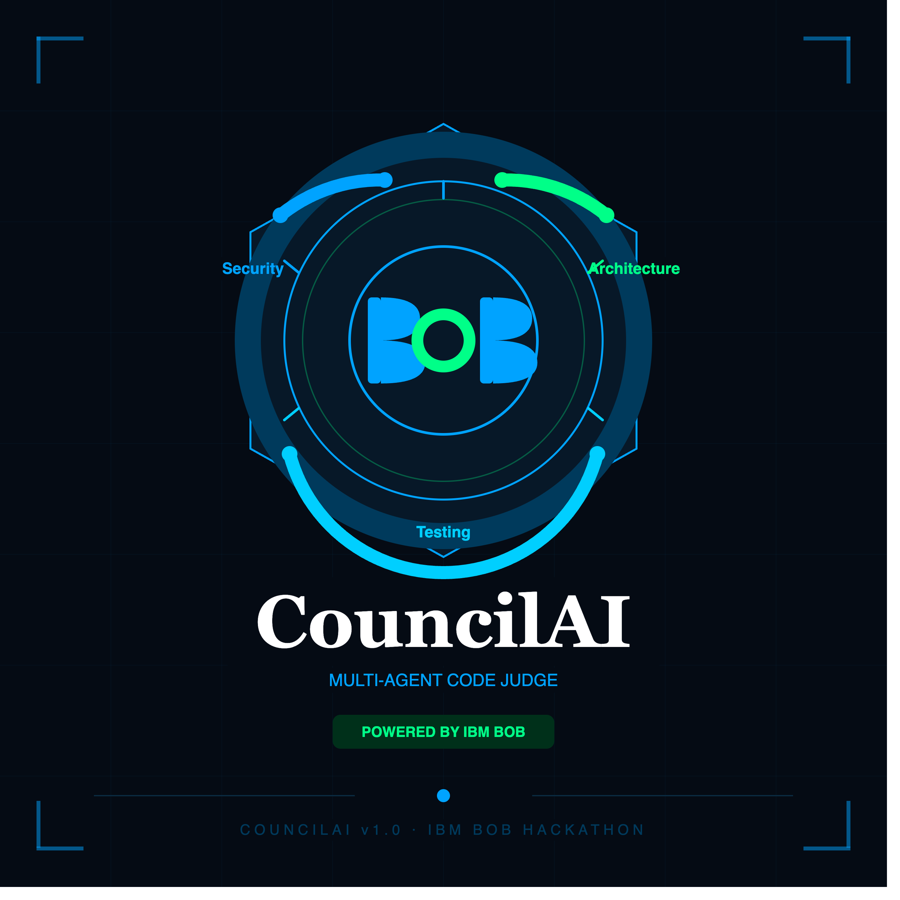

<div align="center">

# ⚖️ CouncilAI

### Multi-Agent Software Engineering Judge
**IBM TechXchange Pre-conference Dev Day Hackathon 2026**



</div>

---

## 🧠 The Problem

Today's AI coding tools review code from a **single perspective**.
One agent. One opinion. No conflict resolution. No audit trail.

When AI agents disagree on a code change — **who decides who is right?**

---

## 💡 Our Solution

CouncilAI deploys **four IBM Bob specialist subagents in parallel**, each
reviewing every code change from their domain of expertise.

               IBM Bob
                  │
     ┌────────────┼────────────┐
     ↓            ↓            ↓            ↓
 Security   Architecture  Testing    Performance
   Agent       Agent       Agent       Agent
     │            │            │            │
     └────────────┼────────────┴────────────┘
                  ↓
           Conflict Detector
                  ↓
           Evidence Checker
                  ↓
             Final Judge
                  ↓
        ┌─────────┴─────────┐
        ↓                   ↓
     APPROVE              REJECT

| Agent | Responsibility |
|---|---|
| 🔒 Security Agent | Detects vulnerabilities, injection risks, hardcoded secrets |
| 🏗️ Architecture Agent | Evaluates design patterns, scalability, coupling |
| 🧪 Testing Agent | Checks coverage, edge cases, test quality |
| ⚡ Performance Agent | Flags O(n²) loops, SELECT *, blocking sleep calls |

A **Conflict Detector** identifies when agents disagree.
An **Evidence Checker** weighs each agent's reasoning by relevance and confidence.
A **Final Judge** delivers an auditable `APPROVE` or `REJECT` verdict with full reasoning.

---

## 🏗️ Project Structure
councilai-ibm-hackathon/
│
├── backend/          # FastAPI orchestration server
├── agents/           # Specialist Bob subagents
├── frontend/         # React verdict dashboard
├── tests/            # Test suites
├── docs/             # Architecture documentation
├── bob_sessions/     # IBM Bob task session screenshots (mandatory)
├── .env.example      # Environment variable template
└── README.md

---

## 👥 Team CouncilAI

| Member | Role |
|---|---|
| Farhan | Backend / Agent Orchestration |
| [Fatima] | Frontend / Testing / Demo |

---

## 🛠️ Tech Stack

| Layer | Technology |
|---|---|
| AI Agents | IBM Bob (subagents, parallel execution) |
| LLM | watsonx.ai / IBM Granite |
| Backend | Python + FastAPI |
| Frontend | React |
| Version Control | GitHub |

---

## 🚀 Setup

```bash
# Clone the repo
git clone https://github.com/Farhan8007/councilai-ibm-hackathon.git
cd councilai-ibm-hackathon

# Set up environment variables
cp .env.example .env
# Add your watsonx credentials to .env

# Install backend dependencies
cd backend
pip install -r requirements.txt

# Install frontend dependencies
cd ../frontend
npm install
```

```markdown
---

## 📸 Bob Sessions

All IBM Bob task session screenshots are stored in `/bob_sessions` as required
by the hackathon submission guidelines.

---

## 🔒 Security

Never commit your `.env` file. It is protected by `.gitignore`.
See `SECURITY.MD` for full guidelines.

---

<div align="center">

Built with ❤️ using IBM Bob · watsonx.ai · IBM TechXchange Hackathon 2026

</div>
```

---

Once you've saved it, push it:

```bash
git add README.md
git commit -m "Add CouncilAI README"
git push origin backend/farhan
```

Then merge to main:

```bash
git checkout main
git merge backend/farhan
git push origin main
git checkout backend/farhan
```

Paste your terminal output here when done and we'll move to `.env.example` next!
